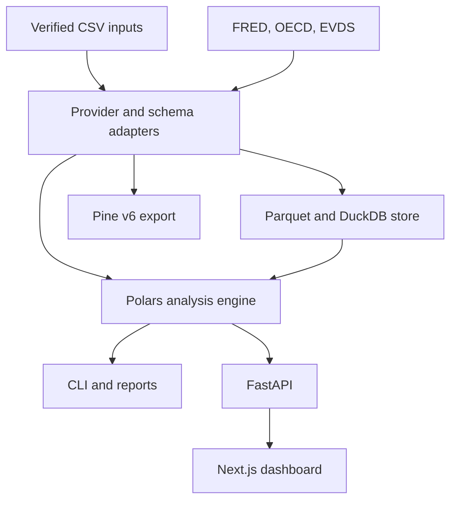

# Architecture

InflationWeaver keeps data acquisition, financial calculations, and presentation separate. The Python engine is the shared mathematical implementation for CLI and API workflows. The dashboard uses a deterministic TypeScript reference calculator locally by default, or presents Python analysis from its configured API. Pine is a separately generated deployment format that runs inside TradingView.

## Component responsibilities

| Component | Responsibility | Excluded responsibility |
| --- | --- | --- |
| `models.py` | Identified `Series` and serializable `AnalysisResult` contracts | Inferring publisher identity from filenames |
| `engine.py` | Validation, monthly compounding, CPI splicing, FX, analysis, comparison, fixed-unit portfolios and deposit illustrations | Downloading market data or execution simulation |
| `backtest.py` | Consume source net equity and optionally unitize beginning-of-period flows | Trading decisions, fills, intraperiod cashflow accounting |
| `providers.py` | Canonical CSV, integrity sidecars and explicit official-provider adapters | Universal market download, silent proxy substitution |
| Local store module | Parquet observations, DuckDB inventory and metadata retrieval | A production HA database or access-control system |
| `cli.py` | Reproducible local commands and output files | Background daemon guaranteed to remain online |
| `api.py` | Typed request contracts, analysis routes and generated OpenAPI | Built-in user accounts, public internet authentication |
| Pine generator | Embed validated CPI and export Pine v6 | HTTP fetching or provisioning a TradingView symbol |
| `web/` | Upload/control flows, charts, metrics and downloads | Independently guessing financial methodology |
| `.github/workflows/` | Tests, build and explicitly configured automation | Ownership of provider access or data redistribution rights |

## Data model

The canonical observation table contains `date` and `value`. `available_date`, when present, records public availability of the **supplied observation**. Extra provenance or published-rate columns are preserved by CSV ingestion without silently changing their economic meaning.

`Series` metadata carries identifier, kind, currency, source and synthetic/constructed state. The same object flows through validation and analysis; transformations create identified outputs rather than silently relabeling the source. A CPI hybrid records its upstream identities, switch and scaling. A converted asset records the FX route.

`AnalysisResult` has three parts:

| Part | Contents |
| --- | --- |
| `points` | Asset/CPI observations, matched dates, base-100 indices, real base-money value and drawdowns |
| `metrics` | Nominal/inflation/real terminal returns and CAGR, maximum drawdowns, elapsed days and observation count |
| `metadata` | Source identifiers, currency, alignment, actual/requested dates, staleness policy, baseline CPI and construction label |

Dates are JSON ISO strings. Summary percentage fields use percentage units: `20` means 20%, not 0.20. Index fields normalize to 100 at the actual base. Full field names are defined by the code and exposed in API output.

## Storage and integrity

The local store persists observations as Parquet with a DuckDB catalog for discovery. Data remains outside committed source by default. Use `INFLATIONWEAVER_STORE` to select a controlled location. Synthetic fixtures under `examples/` are intentionally committed; licensed histories, provider secrets and generated personal reports should not be committed.

Canonical CSV exports include a `filename.csv.metadata.json` sidecar with schema version, series identity, kind, currency, source, synthetic flag, row count and SHA-256. Import verifies a present checksum and rejects conflicting metadata. The store and sidecars support reproducibility; they are not a cryptographic publisher-authentication service.

Data update manifests describe an explicit series list. Local paths are resolved relative to the manifest. Provider mappings are deliberate: FRED uses one exact series, OECD requires dimension filters, and EVDS compatibility uses one exact series code. A manifest should select a single, understood economic quantity rather than normalize an ambiguous multi-series response heuristically.

## Source adapters and network boundary

FRED observations use its documented authenticated API and original levels (`units=lin`). Missing provider values are not replaced with guessed observations. The default adapter retrieves current-vintage data, not a historical ALFRED replay.

OECD's adapter accepts HTTPS queries on `sdmx.oecd.org`, requests CSV and filters explicit dimensions. The current Data Explorer varies by dataset; there is no universal country/CPI key baked into the adapter. Remaining duplicate dates signal an ambiguous selection.

EVDS is an **EVDS2 compatibility** implementation for the documented single-series response, with the key in its header. It is not a claim of live-verified support for a changed EVDS3 API. Redirects fail deliberately. Canonical exported CSV remains the route when a provider portal/API contract changes.

TÜİK and ENAG are supported as verified imports and source-aware calculations. ENAG reports do not become a fabricated TradingView ticker, and direct scraping is not required for the core package.

## Presentation and API

The REST interface exposes `/health`, catalog/series discovery, analysis, comparison and portfolio endpoints. Its request structures are documented by the running `/docs` OpenAPI interface. Provider credentials belong to the backend environment, never a browser-exposed `NEXT_PUBLIC_*` value.

The dashboard uses TypeScript and Next.js, with TradingView Lightweight Charts for numeric financial plots. With `NEXT_PUBLIC_API_URL` empty, calculations run locally in a TypeScript reference implementation and uploads remain in browser memory. A configured API receives full selected series for Python calculation; failed requests do not silently switch engines. The UI's comparison shares baseline/end decision dates while retaining each asset's intermediate frequency; Python `compare_assets` uses exact common observation dates. See [dashboard.md](dashboard.md) for the distinction. Source labels, baseline information and synthetic status should remain visible. Frontend exports are views of analysis results, not new historical data sources. The upstream chart notice and TradingView link are retained separately from the first-party 0BSD grant.

Pine exports encode CPI snapshots. Updating a Python-side store does not update an already pasted TradingView script. Regenerate and verify the export whenever the chosen source series changes. Pine's symbol history, chart cadence and execution limits are independent of Python's arbitrary historical dates.

## Operational model

This version runs well as a local research tool and integration package. CLI analysis is stateless apart from chosen input/output and store paths. The API and web app are separate processes. Scheduled jobs need explicit manifests, keys where applicable and a persistent output/store destination.

For a shared service, add TLS termination, authentication/authorization, request-size/rate limits, storage isolation, monitoring, scheduled-provider retry policy and backups. DuckDB/Parquet operations need a deliberate writer/concurrency policy before multi-worker deployment. Do not advertise the starter configuration as an HA or audited multi-tenant platform.

## Testing boundary

Python tests exercise identities, validation failures, provider response contracts, store persistence and API requests. Web checks cover types, parsers/presentation behavior and production build. Pine tests validate generated source structure and deterministic fixtures; they do not execute TradingView's compiler.

Live data availability, licensed historical coverage, release vintage authenticity and deployment uptime require their own operational evidence. Preserve that distinction when reporting project status.
